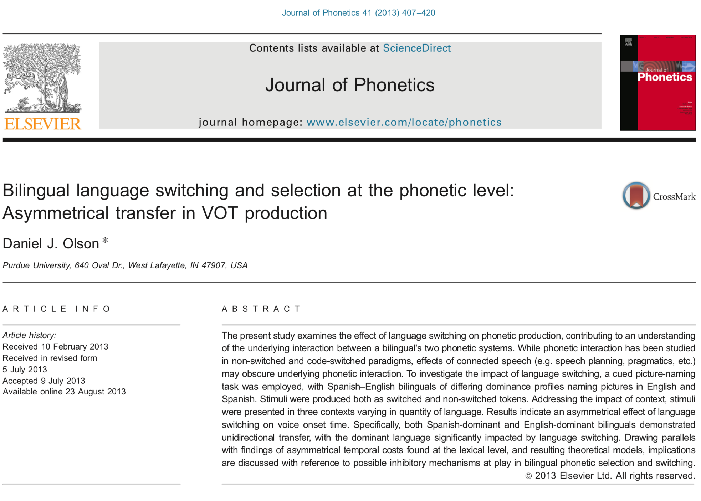

```{r setup, include=FALSE}
options(htmltools.dir.version = FALSE)
library(tidyverse)
```


# Introduction  
 
The article I chose for the online presentation is: Bilingual language switching and selection at the phonetic level: Asymmetrical transfer in VOT production written by Daniel J. Olson. This article was published in the Journal of Phonetics and can be found [here](https://ac.els-cdn.com/S0095447013000405/1-s2.0-S0095447013000405-main.pdf?_tid=b6cf2642-bcb8-478f-bca4-1793cd0f66bf&acdnat=1523490953_6e6b48b664d45ca11d0eb6e6f7a10dd8).

``` {r, fig.align="center", out.width= "500px", out.height= "400px", cache=FALSE, echo=FALSE, retina=2}

```
---

# Summary of Main Points

#### Main Points:
This study examines the effect of language switching on the production of voice onset time (VOT) of high profiency Spanish-English bilinguals. The bilinguals were split into two groups based on their L1 (English-dominant or Spanish-dominant). The author uses a cued picture-naming task in an experimental setting. Since voiceless stops in Spanish have short-lag VOT (0-30ms) and English voiceless stops have long-lag VOT (30-120ms) the author hypothesizes that language switching will impact phonetic production.

#### Research questions:
1. Does language switching impact phonetic production, as evidenced by differences in VOT between switched and non-switched tokens?

2. Does language context impact phonetic production, seen as differences in VOT dependent on the language context of the experimental paradigm?

---

# Summary of Main Points (cont'd)

### The Study 
20 Spanish-English bilinguals were asked to take part in a cue picture-naming study. Participants were either Spanish-dominant or English-dominant. All target stimuli contained voiceless word-intial stops /k/ or /p/. Targets were named in Spanish and English, both as switch or stay tokens. Switch tokens were those in which the response language was different from that was used in the preceding token. Stay tokens were those in which the response language was the same as the one from the preceding token. Trials were done in either Monolingual English context, Monolingual Spanish Context, or in a Bilingual Context. The researcher measured the duration of the VOT of the responses with the intention of analyzing whether the context of language had an effect on phonetic production.

---

# Explanation of Analysis

#### What did they do?
He used a liner mixed model for his analysis. He established the criterion and the predictors as Language Context (Monlingual Context vs. Bilingual Context) and Response Type (Switch or Non-swtich token), with subject as a random effect. He compared the main effects and interactions between groups and found that there was an interaction of Language Context and Response Type. He did a separate ANOVA for each group (English-dominant and Spanish-dominant) and compared the results of the two groups.


#### How did they do it
The author analyzed the data in R but he didn't specify the packages he used. He did an ANOVA and checked for main effects and interactions. The results section was a bit confusing but he added graphs which helped make sense of the analysis. 

---
# Explanation of Analysis (cont'd)

#### Why did they do it?
The goal of the article was to find out if there was an interaction in the phonetic systems of bilinguals. The statistical analysis proved that there was an interaction of language context, meaning that the language mode the bilingual was in at the time of task impacted the phonetic production of VOT for the opposite language. He found that there was an asymmetrical transfer of VOT production. The VOT shifted in the direction of the participant's dominant language, L1, but there was no significant effect when switching into the less dominant L2. He answered his research questions and confirmed his hypotheses through the statistical analysis. 

---

# Appropriateness of Analysis

#### Was this the best analysis?

He was able to confirm his hypotheses using his method of analysis. But, the author could've been more thorough in reporting and checking his models. He used a liner mixed model but didn't explain his random effect well and the alpha was not reported. He was capitilizing on chance by running post-hoc tests. He increased the chances of commiting a Type I Error by conducting too many analyses. The analysis could have been better. 

#### Did they do something you haven't seen before?
I hadn't seen a liner mixed model analysis before this article. 
I don't think I've ever noticed researchers report doing diagnostics testing on the measurements segmented using Praat scripts. I'm not sure if that's standard practice.

---

# Presentation of Results

#### Did they properly/accurately explain their results?
The author reported the model used to fit the data, the criterion, and the predictors. He didn't mention model diagnostics or test for model assumptions. There was also no mention of confidence intervals, beta weights, or alpha. P-values were mentioned throughout the article.

#### Did they properly/accurately intepret their findings?
I think he did accurately intepret his results. He explained the main effects and the interactions well and what it meant for his data.

---

# Presentation of Results (cont'd)

#### Did they properly/accurately use graphs/tables? 
The author used bar graphs to illustrate the mean VOT produced by each group (Spanish-dominant and English-dominant) in each language (Spanish or English). In my opinion, a better way to plot the data would be to use a boxplot instead of a bar graph. I would also flip the axes so that the VOT is on the x-axis. This can be done in R using the `coord_flip()` function, it would make the boxplots horizontal and easier to read. I'm also new to this so I might be wrong.

---

# Describe what you liked/disliked about their analysis

#### Liked
I liked that the researcher ran diagnostics on the VOT measurements. 10% of the tokens were re-coded to confirm the reliability of the Praat script used to segment the data.

#### Disliked
I didn't like that the study only focused on /k/ and /p/. The study would have been more complete had the researcher included all voiceless stops /p,t,k/; then he would have been able to compare them to one another. It would be interesting to see this study done with both voiced and voiceless stops /p,t,k,b,d,g/ since Spanish voiced stops are in a different distribution than those in English.


